# 情侣互动在线点单与问卷平台设计文档

## 1. 项目概述

### 1.1 项目背景
情侣互动在线点单与问卷平台是一个为情侣提供互动体验的web应用。平台支持两种核心功能：
1. **在线点单功能**：一方创建类似堂食的订单，另一方接收推送并完成订单，支持状态同步和评价
2. **问卷调查功能**：支持发布问卷，情侣另一方填写并生成数据表格

### 1.2 技术栈
- **后端**：Java + Spring Boot + MySQL
- **前端**：Vue 3 + Vant UI (移动端优化) + Axios
- **UI设计**：Apple Design System风格 + 响应式布局
- **部署环境**：阿里云ECS（2核2G）
- **数据库**：MySQL 8.0
- **对象存储**：MinIO (图片、文件存储)
- **消息推送**：WebSocket + PWA推送 + 浏览器原生通知
- **第三方集成**：微信开放平台 (登录/支付)
- **管理后台**：Vue 3 + Element Plus

### 1.3 核心特性
- 手机号注册登录 + 微信一键登录
- 用户账号管理与配对系统
- 管理员后台系统（独立权限体系）
- 实时消息推送与状态同步
- 订单创建、处理与评价（支持表情和图片）
- 多类型问卷（单选、多选、填空）创建、填写与统计
- Apple风格响应式设计，移动端优先
- PWA支持与原生推送通知
- 自定义UI主题（背景颜色等）
- MinIO对象存储（图片、文件管理）

## 2. 系统架构

### 2.1 整体架构图

```mermaid
graph TB
    subgraph "前端层"
        A[Vue 3 移动端应用]
        A1[Vue 3 管理后台]
        B[Vant UI (移动端)]
        B1[Element Plus (管理后台)]
        C[Axios HTTP客户端]
        D[WebSocket客户端]
        E[PWA Service Worker]
    end
    
    subgraph "后端层"
        F[Spring Boot应用]
        G[Spring Security]
        H[WebSocket处理器]
        I[REST API控制器]
        J[业务服务层]
        K[管理员API控制器]
        L[推送通知服务]
        M[MinIO客户端]
        N[微信API集成]
    end
    
    subgraph "数据层"
        O[MySQL数据库]
        P[Redis缓存]
        Q[MinIO对象存储]
    end
    
    A --> C
    A --> D
    A --> E
    A1 --> C
    C --> I
    C --> K
    D --> H
    H --> J
    I --> J
    K --> J
    J --> O
    J --> P
    J --> M
    M --> Q
    L --> E
    J --> N
    
    G --> I
    G --> H
    G --> K
```

### 2.2 模块架构

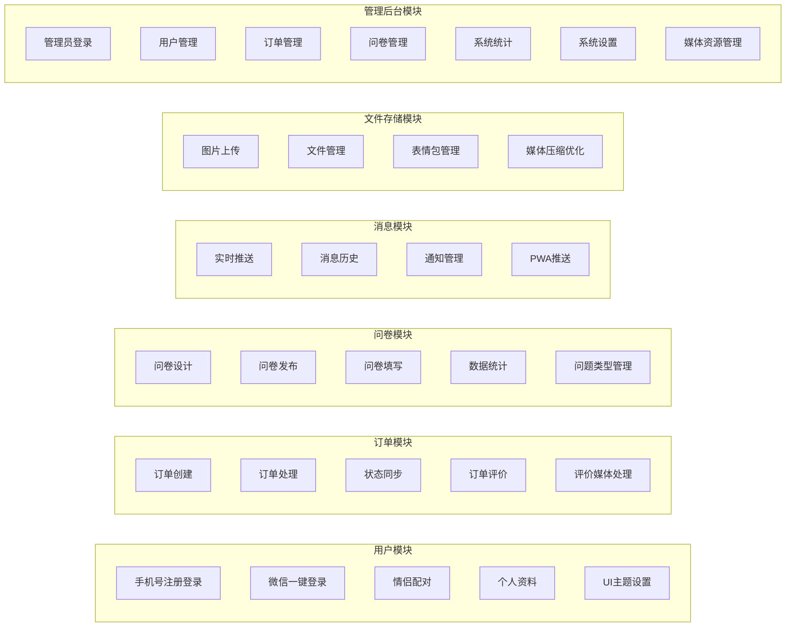

## 3. 前端架构

### 3.1 移动端优先设计

#### 3.1.1 响应式布局策略

```css
/* 移动端优先设计 */
.container {
  /* 手机端默认 */
  padding: 16px;
  font-size: 16px;
}

/* 平板端适配 */
@media (min-width: 768px) {
  .container {
    max-width: 768px;
    margin: 0 auto;
    padding: 24px;
  }
}

/* 桌面端适配 */
@media (min-width: 1024px) {
  .container {
    max-width: 1200px;
    padding: 32px;
    display: grid;
    grid-template-columns: 1fr 3fr;
  }
}
```

#### 3.1.2 视口缩放配置

```html
<!-- PWA 支持和移动端优化 -->
<meta name="viewport" content="width=device-width, initial-scale=1.0, maximum-scale=1.0, user-scalable=no">
<meta name="apple-mobile-web-app-capable" content="yes">
<meta name="apple-mobile-web-app-status-bar-style" content="default">
<meta name="apple-mobile-web-app-title" content="情侣互动">
<link rel="apple-touch-icon" href="/icons/apple-touch-icon.png">
<link rel="manifest" href="/manifest.json">
```

### 3.2 Apple风格UI设计系统

#### 3.2.1 设计令牌系统

```scss
// Apple风格颜色系统
$colors: (
  // 主色调
  primary: #007AFF,
  secondary: #5856D6,
  success: #34C759,
  warning: #FF9500,
  danger: #FF3B30,
  
  // 中性色
  gray-900: #1C1C1E,
  gray-800: #2C2C2E,
  gray-700: #3A3A3C,
  gray-600: #48484A,
  gray-500: #636366,
  gray-400: #8E8E93,
  gray-300: #C7C7CC,
  gray-200: #D1D1D6,
  gray-100: #E5E5EA,
  gray-50: #F2F2F7,
  
  // 背景色
  background-primary: #FFFFFF,
  background-secondary: #F2F2F7,
  background-tertiary: #FFFFFF
);

// 字体系统
$typography: (
  font-family: -apple-system, BlinkMacSystemFont, 'Segoe UI', Roboto, sans-serif,
  
  // 字号大小
  text-xs: 12px,
  text-sm: 14px,
  text-base: 16px,
  text-lg: 18px,
  text-xl: 20px,
  text-2xl: 24px,
  text-3xl: 28px,
  text-4xl: 32px,
  
  // 行高
  leading-tight: 1.25,
  leading-normal: 1.5,
  leading-relaxed: 1.75
);

// 圆角系统
$border-radius: (
  sm: 4px,
  base: 8px,
  lg: 12px,
  xl: 16px,
  2xl: 20px,
  full: 9999px
);

// 阴影系统
$shadows: (
  sm: 0 1px 2px rgba(0, 0, 0, 0.05),
  base: 0 1px 3px rgba(0, 0, 0, 0.1),
  lg: 0 4px 6px rgba(0, 0, 0, 0.07),
  xl: 0 10px 15px rgba(0, 0, 0, 0.1)
);
```

#### 3.2.2 主题切换功能

```typescript
// 主题管理Store
interface ThemeState {
  currentTheme: 'light' | 'dark'
  customColors: {
    primary: string
    background: string
    surface: string
  }
  backgroundImage?: string
}

const useThemeStore = defineStore('theme', {
  state: (): ThemeState => ({
    currentTheme: 'light',
    customColors: {
      primary: '#007AFF',
      background: '#FFFFFF',
      surface: '#F2F2F7'
    }
  }),
  
  actions: {
    setTheme(theme: 'light' | 'dark') {
      this.currentTheme = theme
      document.documentElement.setAttribute('data-theme', theme)
    },
    
    setCustomColor(key: keyof ThemeState['customColors'], color: string) {
      this.customColors[key] = color
      document.documentElement.style.setProperty(`--color-${key}`, color)
    },
    
    setBackgroundImage(imageUrl: string) {
      this.backgroundImage = imageUrl
      document.body.style.backgroundImage = `url(${imageUrl})`
    }
  }
})
```

### 3.3 组件层次结构

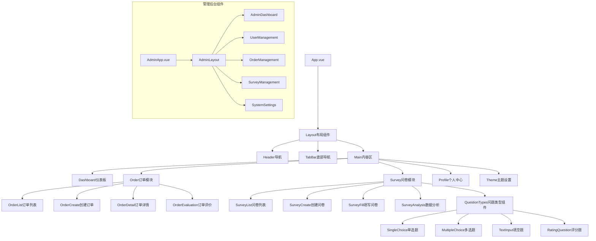

### 3.4 路由结构

#### 3.4.1 移动端路由

| 路径 | 组件 | 权限 | 描述 |
|------|------|------|------|
| `/` | Dashboard | 需登录 | 主页仪表板 |
| `/login` | Login | 公开 | 用户登录 |
| `/register` | Register | 公开 | 用户注册 |
| `/pair` | PairSetup | 需登录 | 情侣配对 |
| `/orders` | OrderList | 需登录 | 订单列表 |
| `/orders/create` | OrderCreate | 需登录 | 创建订单 |
| `/orders/:id` | OrderDetail | 需登录 | 订单详情 |
| `/surveys` | SurveyList | 需登录 | 问卷列表 |
| `/surveys/create` | SurveyCreate | 需登录 | 创建问卷 |
| `/surveys/:id/fill` | SurveyFill | 需登录 | 填写问卷 |
| `/profile` | Profile | 需登录 | 个人中心 |
| `/theme` | ThemeSettings | 需登录 | 主题设置 |

#### 3.4.2 管理后台路由

| 路径 | 组件 | 权限 | 描述 |
|------|------|------|------|
| `/admin` | AdminDashboard | 管理员 | 后台仪表板 |
| `/admin/login` | AdminLogin | 公开 | 管理员登录 |
| `/admin/users` | UserManagement | 管理员 | 用户管理 |
| `/admin/orders` | OrderManagement | 管理员 | 订单管理 |
| `/admin/surveys` | SurveyManagement | 管理员 | 问卷管理 |
| `/admin/statistics` | SystemStatistics | 管理员 | 系统统计 |
| `/admin/settings` | SystemSettings | 管理员 | 系统设置 |

### 3.5 状态管理策略

使用Pinia进行状态管理：

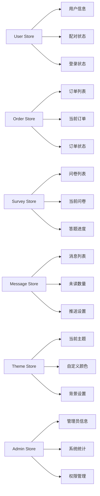

### 3.6 PWA与推送通知集成

#### 3.6.1 Service Worker配置

```typescript
// sw.js - Service Worker
self.addEventListener('push', function(event) {
  const options = {
    body: event.data.json().body,
    icon: '/icons/icon-192x192.png',
    badge: '/icons/badge-72x72.png',
    tag: event.data.json().tag,
    data: event.data.json().data,
    actions: [
      {
        action: 'view',
        title: '查看详情',
        icon: '/icons/view.png'
      },
      {
        action: 'dismiss',
        title: '关闭',
        icon: '/icons/close.png'
      }
    ]
  }
  
  event.waitUntil(
    self.registration.showNotification(event.data.json().title, options)
  )
})

self.addEventListener('notificationclick', function(event) {
  event.notification.close()
  
  if (event.action === 'view') {
    event.waitUntil(
      clients.openWindow(event.notification.data.url)
    )
  }
})
```

#### 3.6.2 推送权限管理

```typescript
// 推送通知权限申请
const requestNotificationPermission = async () => {
  if ('Notification' in window) {
    const permission = await Notification.requestPermission()
    
    if (permission === 'granted') {
      // 注册Service Worker和获取订阅
      const registration = await navigator.serviceWorker.register('/sw.js')
      const subscription = await registration.pushManager.subscribe({
        userVisibleOnly: true,
        applicationServerKey: urlBase64ToUint8Array(vapidPublicKey)
      })
      
      // 发送订阅信息到服务器
      await fetch('/api/push/subscribe', {
        method: 'POST',
        body: JSON.stringify(subscription),
        headers: {
          'Content-Type': 'application/json'
        }
      })
    }
  }
}
```

### 3.7 API集成层

```typescript
// API接口定义示例
interface OrderAPI {
  createOrder(orderData: OrderCreateDto): Promise<Order>
  getOrders(status?: OrderStatus): Promise<Order[]>
  updateOrderStatus(id: number, status: OrderStatus): Promise<void>
  evaluateOrder(id: number, evaluation: OrderEvaluation): Promise<void>
}

interface SurveyAPI {
  createSurvey(surveyData: SurveyCreateDto): Promise<Survey>
  getSurveys(): Promise<Survey[]>
  submitSurveyResponse(surveyId: number, responses: SurveyResponse[]): Promise<void>
  getSurveyAnalysis(surveyId: number): Promise<SurveyAnalysis>
}

interface AdminAPI {
  getUsers(): Promise<User[]>
  getUserStatistics(): Promise<UserStats>
  getOrderStatistics(): Promise<OrderStats>
  getSurveyStatistics(): Promise<SurveyStats>
  updateSystemSettings(settings: SystemSettings): Promise<void>
}

interface PushAPI {
  subscribe(subscription: PushSubscription): Promise<void>
  unsubscribe(endpoint: string): Promise<void>
  sendNotification(userId: number, notification: NotificationData): Promise<void>
}
```

## 4. 后端架构

### 4.1 API端点参考

#### 4.1.1 用户认证API

| 端点 | 方法 | 描述 | 请求体 | 响应 |
|------|------|------|--------|------|
| `/api/auth/register` | POST | 手机号注册 | `{phone, password, sms_code}` | `{token, user}` |
| `/api/auth/login` | POST | 手机号登录 | `{phone, password}` | `{token, user}` |
| `/api/auth/sms/send` | POST | 发送短信验证码 | `{phone, type}` | `{success: boolean}` |
| `/api/auth/wechat/login` | POST | 微信登录 | `{code, state}` | `{token, user}` |
| `/api/auth/wechat/bind` | POST | 绑定微信 | `{code, phone}` | `{success: boolean}` |
| `/api/auth/pair` | POST | 情侣配对 | `{partnerCode}` | `{paired: boolean}` |
| `/api/auth/profile` | GET | 获取用户资料 | - | `{user}` |

#### 4.1.2 订单管理API

| 端点 | 方法 | 描述 | 请求体 | 响应 |
|------|------|------|--------|------|
| `/api/orders` | GET | 获取订单列表 | - | `{orders[]}` |
| `/api/orders` | POST | 创建订单 | `{items[], note, type}` | `{order}` |
| `/api/orders/{id}` | GET | 获取订单详情 | - | `{order}` |
| `/api/orders/{id}/status` | PUT | 更新订单状态 | `{status}` | `{success: boolean}` |
| `/api/orders/{id}/evaluate` | POST | 评价订单 | `{rating, comment}` | `{evaluation}` |

#### 4.1.3 问卷管理API

| 端点 | 方法 | 描述 | 请求体 | 响应 |
|------|------|------|--------|------|
| `/api/surveys` | GET | 获取问卷列表 | - | `{surveys[]}` |
| `/api/surveys` | POST | 创建问卷 | `{title, questions[], settings}` | `{survey}` |
| `/api/surveys/{id}` | GET | 获取问卷详情 | - | `{survey}` |
| `/api/surveys/{id}/submit` | POST | 提交问卷答案 | `{responses[]}` | `{submission}` |
| `/api/surveys/{id}/analysis` | GET | 获取问卷分析 | - | `{analysis}` |

#### 4.1.4 管理后台API

| 端点 | 方法 | 描述 | 请求体 | 响应 |
|------|------|------|--------|------|
| `/api/admin/login` | POST | 管理员登录 | `{username, password}` | `{token, admin}` |
| `/api/admin/users` | GET | 获取用户列表 | - | `{users[], pagination}` |
| `/api/admin/users/{id}` | PUT | 更新用户状态 | `{status, reason}` | `{success: boolean}` |
| `/api/admin/orders` | GET | 获取订单管理列表 | - | `{orders[], pagination}` |
| `/api/admin/surveys` | GET | 获取问卷管理列表 | - | `{surveys[], pagination}` |
| `/api/admin/statistics` | GET | 获取系统统计 | - | `{userStats, orderStats, surveyStats}` |
| `/api/admin/settings` | GET/PUT | 系统设置管理 | `{settings}` | `{settings}` |

#### 4.1.5 推送通知API

| 端点 | 方法 | 描述 | 请求体 | 响应 |
|------|------|------|--------|------|
| `/api/push/subscribe` | POST | 订阅推送通知 | `{subscription}` | `{success: boolean}` |
| `/api/push/unsubscribe` | DELETE | 取消订阅 | `{endpoint}` | `{success: boolean}` |
| `/api/push/test` | POST | 测试推送 | `{message}` | `{success: boolean}` |

#### 4.1.6 文件存储API

| 端点 | 方法 | 描述 | 请求体 | 响应 |
|------|------|------|--------|------|
| `/api/files/upload` | POST | 文件上传 | `multipart/form-data` | `{fileUrl, thumbnail}` |
| `/api/files/images/upload` | POST | 图片上传 | `multipart/form-data` | `{imageUrl, thumbnailUrl}` |
| `/api/files/emoji/list` | GET | 获取表情列表 | - | `{emojis[]}` |
| `/api/files/{fileId}` | DELETE | 删除文件 | - | `{success: boolean}` |
| `/api/files/presigned-url` | POST | 获取预签名上传URL | `{fileName, fileType}` | `{uploadUrl, accessUrl}` |

### 4.2 数据模型设计

#### 4.2.1 用户相关模型

```sql
-- 用户表
CREATE TABLE users (
    id BIGINT PRIMARY KEY AUTO_INCREMENT,
    phone VARCHAR(20) UNIQUE NOT NULL, -- 手机号
    username VARCHAR(50) UNIQUE, -- 用户名（可选）
    password VARCHAR(255), -- 密码（手机号登录必填）
    wechat_openid VARCHAR(100) UNIQUE, -- 微信OpenID
    wechat_unionid VARCHAR(100), -- 微信UnionID
    nickname VARCHAR(50),
    avatar_url VARCHAR(255),
    partner_id BIGINT,
    pair_code VARCHAR(20) UNIQUE,
    theme_settings JSON, -- 主题设置
    push_subscription JSON, -- 推送订阅信息
    login_type ENUM('PHONE', 'WECHAT', 'BOTH') DEFAULT 'PHONE',
    status ENUM('ACTIVE', 'INACTIVE', 'BANNED') DEFAULT 'ACTIVE',
    created_at TIMESTAMP DEFAULT CURRENT_TIMESTAMP,
    updated_at TIMESTAMP DEFAULT CURRENT_TIMESTAMP ON UPDATE CURRENT_TIMESTAMP,
    INDEX idx_phone (phone),
    INDEX idx_wechat_openid (wechat_openid),
    INDEX idx_partner_id (partner_id),
    INDEX idx_pair_code (pair_code),
    INDEX idx_status (status)
);

-- SMS验证码表
CREATE TABLE sms_codes (
    id BIGINT PRIMARY KEY AUTO_INCREMENT,
    phone VARCHAR(20) NOT NULL,
    code VARCHAR(10) NOT NULL,
    type ENUM('REGISTER', 'LOGIN', 'RESET_PASSWORD') NOT NULL,
    used BOOLEAN DEFAULT FALSE,
    expired_at TIMESTAMP NOT NULL,
    created_at TIMESTAMP DEFAULT CURRENT_TIMESTAMP,
    INDEX idx_phone_type (phone, type),
    INDEX idx_expired_at (expired_at)
);

-- 管理员表
CREATE TABLE admins (
    id BIGINT PRIMARY KEY AUTO_INCREMENT,
    username VARCHAR(50) UNIQUE NOT NULL,
    password VARCHAR(255) NOT NULL,
    email VARCHAR(100) UNIQUE NOT NULL,
    role ENUM('SUPER_ADMIN', 'ADMIN', 'MODERATOR') DEFAULT 'ADMIN',
    permissions JSON, -- 权限配置
    last_login_at TIMESTAMP NULL,
    created_at TIMESTAMP DEFAULT CURRENT_TIMESTAMP,
    updated_at TIMESTAMP DEFAULT CURRENT_TIMESTAMP ON UPDATE CURRENT_TIMESTAMP,
    INDEX idx_role (role)
);
```

#### 4.2.2 订单相关模型

```sql
-- 订单表
CREATE TABLE orders (
    id BIGINT PRIMARY KEY AUTO_INCREMENT,
    creator_id BIGINT NOT NULL,
    assignee_id BIGINT NOT NULL,
    title VARCHAR(100) NOT NULL,
    description TEXT,
    order_type ENUM('FOOD', 'DRINK', 'SNACK', 'OTHER') DEFAULT 'FOOD',
    status ENUM('PENDING', 'ACCEPTED', 'IN_PROGRESS', 'COMPLETED', 'CANCELLED') DEFAULT 'PENDING',
    priority ENUM('LOW', 'MEDIUM', 'HIGH') DEFAULT 'MEDIUM',
    due_time TIMESTAMP NULL,
    completed_at TIMESTAMP NULL,
    created_at TIMESTAMP DEFAULT CURRENT_TIMESTAMP,
    updated_at TIMESTAMP DEFAULT CURRENT_TIMESTAMP ON UPDATE CURRENT_TIMESTAMP,
    INDEX idx_creator_id (creator_id),
    INDEX idx_assignee_id (assignee_id),
    INDEX idx_status (status)
);

-- 订单项表
CREATE TABLE order_items (
    id BIGINT PRIMARY KEY AUTO_INCREMENT,
    order_id BIGINT NOT NULL,
    item_name VARCHAR(100) NOT NULL,
    quantity INT DEFAULT 1,
    note TEXT,
    price DECIMAL(10,2),
    FOREIGN KEY (order_id) REFERENCES orders(id) ON DELETE CASCADE
);

-- 订单评价表
CREATE TABLE order_evaluations (
    id BIGINT PRIMARY KEY AUTO_INCREMENT,
    order_id BIGINT NOT NULL UNIQUE,
    evaluator_id BIGINT NOT NULL,
    rating INT NOT NULL CHECK (rating BETWEEN 1 AND 5),
    comment TEXT,
    media_files JSON, -- 媒体文件列表 {type: 'image'|'emoji', url: string, name: string}[]
    created_at TIMESTAMP DEFAULT CURRENT_TIMESTAMP,
    FOREIGN KEY (order_id) REFERENCES orders(id) ON DELETE CASCADE,
    FOREIGN KEY (evaluator_id) REFERENCES users(id)
);
```

#### 4.2.3 问卷相关模型

```sql
-- 问卷表
CREATE TABLE surveys (
    id BIGINT PRIMARY KEY AUTO_INCREMENT,
    creator_id BIGINT NOT NULL,
    title VARCHAR(200) NOT NULL,
    description TEXT,
    status ENUM('DRAFT', 'PUBLISHED', 'CLOSED') DEFAULT 'DRAFT',
    anonymous BOOLEAN DEFAULT FALSE,
    multiple_submit BOOLEAN DEFAULT FALSE,
    start_time TIMESTAMP NULL,
    end_time TIMESTAMP NULL,
    created_at TIMESTAMP DEFAULT CURRENT_TIMESTAMP,
    updated_at TIMESTAMP DEFAULT CURRENT_TIMESTAMP ON UPDATE CURRENT_TIMESTAMP,
    INDEX idx_creator_id (creator_id),
    INDEX idx_status (status)
);

-- 问卷题目表
CREATE TABLE survey_questions (
    id BIGINT PRIMARY KEY AUTO_INCREMENT,
    survey_id BIGINT NOT NULL,
    question_type ENUM('SINGLE_CHOICE', 'MULTIPLE_CHOICE', 'TEXT_INPUT', 'RATING', 'DATE') NOT NULL,
    title VARCHAR(500) NOT NULL,
    description TEXT,
    required BOOLEAN DEFAULT FALSE,
    order_index INT NOT NULL,
    options JSON, -- 选择题选项
    validation JSON, -- 校验规则（最小值、最大值、正则表达式等）
    settings JSON, -- 其他设置
    FOREIGN KEY (survey_id) REFERENCES surveys(id) ON DELETE CASCADE,
    INDEX idx_survey_id (survey_id),
    INDEX idx_question_type (question_type)
);

-- 问卷提交表
CREATE TABLE survey_submissions (
    id BIGINT PRIMARY KEY AUTO_INCREMENT,
    survey_id BIGINT NOT NULL,
    respondent_id BIGINT NOT NULL,
    submitted_at TIMESTAMP DEFAULT CURRENT_TIMESTAMP,
    FOREIGN KEY (survey_id) REFERENCES surveys(id) ON DELETE CASCADE,
    FOREIGN KEY (respondent_id) REFERENCES users(id),
    UNIQUE KEY unique_submission (survey_id, respondent_id)
);

-- 问卷答案表
CREATE TABLE survey_responses (
    id BIGINT PRIMARY KEY AUTO_INCREMENT,
    submission_id BIGINT NOT NULL,
    question_id BIGINT NOT NULL,
    answer_text TEXT,
    answer_options JSON, -- 多选答案
    answer_number DECIMAL(10,2), -- 数值答案
    FOREIGN KEY (submission_id) REFERENCES survey_submissions(id) ON DELETE CASCADE,
    FOREIGN KEY (question_id) REFERENCES survey_questions(id) ON DELETE CASCADE
);

-- 系统设置表
CREATE TABLE system_settings (
    id BIGINT PRIMARY KEY AUTO_INCREMENT,
    setting_key VARCHAR(100) UNIQUE NOT NULL,
    setting_value JSON NOT NULL,
    description TEXT,
    updated_by BIGINT,
    updated_at TIMESTAMP DEFAULT CURRENT_TIMESTAMP ON UPDATE CURRENT_TIMESTAMP,
    FOREIGN KEY (updated_by) REFERENCES admins(id)
);

-- 推送通知记录表
CREATE TABLE push_notifications (
    id BIGINT PRIMARY KEY AUTO_INCREMENT,
    user_id BIGINT NOT NULL,
    title VARCHAR(200) NOT NULL,
    body TEXT NOT NULL,
    data JSON,
    sent_at TIMESTAMP DEFAULT CURRENT_TIMESTAMP,
    read_at TIMESTAMP NULL,
    clicked_at TIMESTAMP NULL,
    FOREIGN KEY (user_id) REFERENCES users(id) ON DELETE CASCADE,
    INDEX idx_user_id (user_id),
    INDEX idx_sent_at (sent_at)
);

-- 文件存储表
CREATE TABLE media_files (
    id BIGINT PRIMARY KEY AUTO_INCREMENT,
    file_name VARCHAR(255) NOT NULL,
    original_name VARCHAR(255) NOT NULL,
    file_type ENUM('IMAGE', 'EMOJI', 'DOCUMENT') NOT NULL,
    mime_type VARCHAR(100) NOT NULL,
    file_size BIGINT NOT NULL,
    file_url VARCHAR(500) NOT NULL, -- MinIO存储路径
    thumbnail_url VARCHAR(500), -- 缩略图路径
    bucket_name VARCHAR(100) NOT NULL,
    object_key VARCHAR(500) NOT NULL,
    uploaded_by BIGINT,
    upload_ip VARCHAR(45),
    status ENUM('UPLOADING', 'COMPLETED', 'FAILED', 'DELETED') DEFAULT 'UPLOADING',
    created_at TIMESTAMP DEFAULT CURRENT_TIMESTAMP,
    updated_at TIMESTAMP DEFAULT CURRENT_TIMESTAMP ON UPDATE CURRENT_TIMESTAMP,
    FOREIGN KEY (uploaded_by) REFERENCES users(id),
    INDEX idx_file_type (file_type),
    INDEX idx_uploaded_by (uploaded_by),
    INDEX idx_status (status),
    INDEX idx_created_at (created_at)
);

-- 表情包表
CREATE TABLE emoji_packages (
    id BIGINT PRIMARY KEY AUTO_INCREMENT,
    package_name VARCHAR(100) NOT NULL,
    description TEXT,
    version VARCHAR(20) DEFAULT '1.0.0',
    icon_url VARCHAR(500),
    total_count INT DEFAULT 0,
    is_default BOOLEAN DEFAULT FALSE,
    is_active BOOLEAN DEFAULT TRUE,
    created_at TIMESTAMP DEFAULT CURRENT_TIMESTAMP,
    updated_at TIMESTAMP DEFAULT CURRENT_TIMESTAMP ON UPDATE CURRENT_TIMESTAMP,
    INDEX idx_package_name (package_name),
    INDEX idx_is_active (is_active)
);

-- 表情表
CREATE TABLE emojis (
    id BIGINT PRIMARY KEY AUTO_INCREMENT,
    package_id BIGINT NOT NULL,
    emoji_name VARCHAR(100) NOT NULL,
    emoji_code VARCHAR(50) NOT NULL, -- 表情代码，如 :smile:
    file_url VARCHAR(500) NOT NULL,
    file_size INT,
    sort_order INT DEFAULT 0,
    usage_count BIGINT DEFAULT 0,
    is_active BOOLEAN DEFAULT TRUE,
    created_at TIMESTAMP DEFAULT CURRENT_TIMESTAMP,
    FOREIGN KEY (package_id) REFERENCES emoji_packages(id) ON DELETE CASCADE,
    UNIQUE KEY unique_emoji_code (package_id, emoji_code),
    INDEX idx_package_id (package_id),
    INDEX idx_emoji_code (emoji_code),
    INDEX idx_usage_count (usage_count)
);
```

### 4.3 业务逻辑层架构

#### 4.3.1 服务层设计

```mermaid
graph TD
    A[Controller层] --> B[Service层]
    B --> C[Repository层]
    
    B --> B1[UserService]
    B --> B2[OrderService]
    B --> B3[SurveyService] 
    B --> B4[NotificationService]
    B --> B6[WeChatService]
    B --> B7[FileStorageService]
    B --> B8[SmsService]
    
    B1 --> B1A[手机号注册登录]
    B1 --> B1B[微信登录集成]
    B1 --> B1C[情侣配对管理]
    B1 --> B1D[用户资料管理]
    B1 --> B1E[主题设置管理]
    
    B2 --> B2A[订单创建管理]
    B2 --> B2B[订单状态流转]
    B2 --> B2C[订单评价处理]
    
    B3 --> B3A[问卷设计管理]
    B3 --> B3B[问卷填写处理]
    B3 --> B3C[数据统计分析]
    B3 --> B3D[问题类型处理]
    
    B4 --> B4A[实时推送]
    B4 --> B4B[消息队列]
    B4 --> B4C[通知模板]
    
    B5 --> B5A[管理员认证]
    B5 --> B5B[用户管理]
    B5 --> B5C[系统统计]
    B5 --> B5D[权限控制]
    
    B6 --> B6A[推送订阅管理]
    B6 --> B6B[PWA通知发送]
    B6 --> B6C[通知统计]
    
    B7 --> B7A[微信登录]
    B7 --> B7B[微信绑定]
    B7 --> B7C[用户信息获取]
    
    B8 --> B8A[文件上传]
    B8 --> B8B[图片处理]
    B8 --> B8C[表情管理]
    B8 --> B8D[MinIO集成]
    
    B9 --> B9A[短信发送]
    B9 --> B9B[验证码管理]
    B9 --> B9C[验证码校验]
```

#### 4.3.2 核心业务流程

**订单处理流程：**
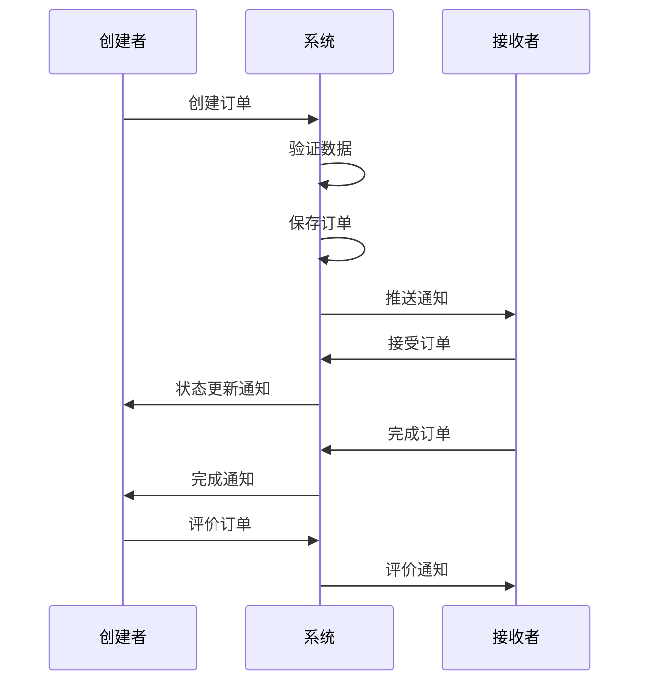

**问卷处理流程：**
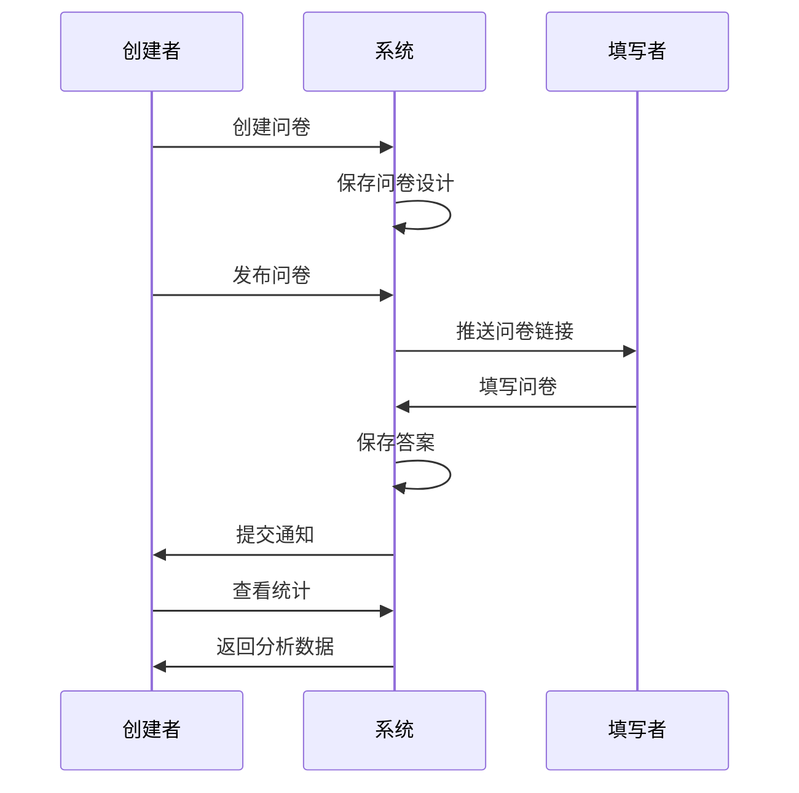

### 4.4 消息推送与实时通信

#### 4.4.1 推送通知架构设计

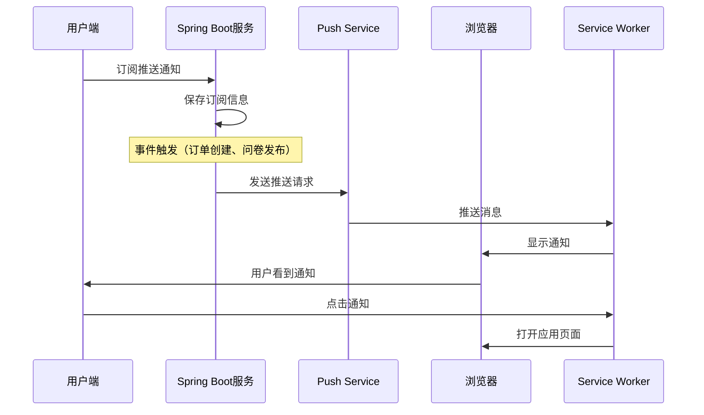

#### 4.4.2 WebSocket连接管理

#### 4.4.2 WebSocket连接管理

```java
@Component
public class WebSocketHandler extends TextWebSocketHandler {
    private final Map<String, WebSocketSession> userSessions = new ConcurrentHashMap<>();
    
    @Override
    public void afterConnectionEstablished(WebSocketSession session) {
        String userId = getUserIdFromSession(session);
        userSessions.put(userId, session);
    }
    
    public void sendToUser(String userId, String message) {
        WebSocketSession session = userSessions.get(userId);
        if (session != null && session.isOpen()) {
            session.sendMessage(new TextMessage(message));
        }
    }
}
```

#### 4.4.3 推送通知服务

```java
@Service
public class PushNotificationService {
    
    @Autowired
    private WebPushService webPushService;
    
    public void sendNotification(Long userId, NotificationData notification) {
        User user = userRepository.findById(userId).orElse(null);
        if (user == null || user.getPushSubscription() == null) {
            return;
        }
        
        try {
            // 发送PWA推送通知
            webPushService.sendNotification(
                user.getPushSubscription(),
                notification.toJson()
            );
            
            // 记录通知历史
            PushNotification pushRecord = new PushNotification();
            pushRecord.setUserId(userId);
            pushRecord.setTitle(notification.getTitle());
            pushRecord.setBody(notification.getBody());
            pushRecord.setData(notification.getData());
            pushNotificationRepository.save(pushRecord);
            
        } catch (Exception e) {
            log.error("发送推送通知失败", e);
        }
    }
    
    public void broadcastToCouple(Long userId, NotificationData notification) {
        User user = userRepository.findById(userId).orElse(null);
        if (user != null && user.getPartnerId() != null) {
            sendNotification(user.getPartnerId(), notification);
        }
    }
}
```

#### 4.4.4 消息类型定义

| 消息类型 | 触发场景 | 消息内容 |
|----------|----------|----------|
| `ORDER_CREATED` | 创建新订单 | 订单详情、创建者信息 |
| `ORDER_STATUS_CHANGED` | 订单状态变更 | 新状态、更新时间 |
| `ORDER_EVALUATED` | 订单被评价 | 评分、评价内容 |
| `SURVEY_PUBLISHED` | 问卷发布 | 问卷信息、填写链接 |
| `SURVEY_SUBMITTED` | 问卷提交 | 提交者信息、提交时间 |
| `SYSTEM_NOTIFICATION` | 系统通知 | 通知内容、重要级别 |
| `ADMIN_ANNOUNCEMENT` | 管理员公告 | 公告内容、发布时间 |
| `PUSH_TEST` | 推送测试 | 测试消息内容 |

### 4.5 微信集成与文件存储

#### 4.5.1 微信登录集成

```java
@Service
public class WeChatService {
    
    @Value("${wechat.appid}")
    private String appId;
    
    @Value("${wechat.secret}")
    private String appSecret;
    
    public WeChatLoginResult processWeChatLogin(String code) {
        // 1. 获取Access Token
        String accessTokenUrl = String.format(
            "https://api.weixin.qq.com/sns/oauth2/access_token?appid=%s&secret=%s&code=%s&grant_type=authorization_code",
            appId, appSecret, code
        );
        
        WeChatTokenResponse tokenResponse = restTemplate.getForObject(accessTokenUrl, WeChatTokenResponse.class);
        
        // 2. 获取用户信息
        String userInfoUrl = String.format(
            "https://api.weixin.qq.com/sns/userinfo?access_token=%s&openid=%s",
            tokenResponse.getAccessToken(), tokenResponse.getOpenid()
        );
        
        WeChatUserInfo userInfo = restTemplate.getForObject(userInfoUrl, WeChatUserInfo.class);
        
        // 3. 查找或创建用户
        User user = userRepository.findByWechatOpenid(userInfo.getOpenid())
            .orElseGet(() -> createUserFromWeChatInfo(userInfo));
        
        return new WeChatLoginResult(user, generateJwtToken(user));
    }
    
    private User createUserFromWeChatInfo(WeChatUserInfo userInfo) {
        User user = new User();
        user.setWechatOpenid(userInfo.getOpenid());
        user.setWechatUnionid(userInfo.getUnionid());
        user.setNickname(userInfo.getNickname());
        user.setAvatarUrl(userInfo.getHeadimgurl());
        user.setLoginType(User.LoginType.WECHAT);
        user.setPairCode(generatePairCode());
        return userRepository.save(user);
    }
}
```

#### 4.5.2 MinIO对象存储集成

```java
@Service
public class FileStorageService {
    
    @Autowired
    private MinioClient minioClient;
    
    @Value("${minio.bucket.images}")
    private String imagesBucket;
    
    @Value("${minio.bucket.files}")
    private String filesBucket;
    
    public FileUploadResult uploadImage(MultipartFile file, Long userId) {
        try {
            // 1. 验证文件类型
            if (!isValidImageType(file.getContentType())) {
                throw new InvalidFileTypeException("不支持的图片类型");
            }
            
            // 2. 生成文件名
            String fileName = generateFileName(file.getOriginalFilename());
            String objectKey = String.format("images/%d/%s", userId, fileName);
            
            // 3. 上传到MinIO
            minioClient.putObject(
                PutObjectArgs.builder()
                    .bucket(imagesBucket)
                    .object(objectKey)
                    .stream(file.getInputStream(), file.getSize(), -1)
                    .contentType(file.getContentType())
                    .build()
            );
            
            // 4. 生成缩略图
            String thumbnailKey = generateThumbnail(objectKey, file.getInputStream());
            
            // 5. 生成访问 URL
            String imageUrl = generatePresignedUrl(imagesBucket, objectKey);
            String thumbnailUrl = generatePresignedUrl(imagesBucket, thumbnailKey);
            
            // 6. 保存文件信息
            MediaFile mediaFile = new MediaFile();
            mediaFile.setFileName(fileName);
            mediaFile.setOriginalName(file.getOriginalFilename());
            mediaFile.setFileType(MediaFile.FileType.IMAGE);
            mediaFile.setMimeType(file.getContentType());
            mediaFile.setFileSize(file.getSize());
            mediaFile.setFileUrl(imageUrl);
            mediaFile.setThumbnailUrl(thumbnailUrl);
            mediaFile.setBucketName(imagesBucket);
            mediaFile.setObjectKey(objectKey);
            mediaFile.setUploadedBy(userId);
            mediaFile.setStatus(MediaFile.Status.COMPLETED);
            
            mediaFileRepository.save(mediaFile);
            
            return new FileUploadResult(imageUrl, thumbnailUrl, mediaFile.getId());
            
        } catch (Exception e) {
            log.error("图片上传失败", e);
            throw new FileUploadException("图片上传失败");
        }
    }
    
    private String generateThumbnail(String originalKey, InputStream inputStream) {
        // 使用Thumbnailator生成缩略图
        String thumbnailKey = originalKey.replace("/images/", "/thumbnails/");
        
        try (ByteArrayOutputStream outputStream = new ByteArrayOutputStream()) {
            Thumbnails.of(inputStream)
                .size(200, 200)
                .outputFormat("jpg")
                .toOutputStream(outputStream);
            
            byte[] thumbnailData = outputStream.toByteArray();
            
            minioClient.putObject(
                PutObjectArgs.builder()
                    .bucket(imagesBucket)
                    .object(thumbnailKey)
                    .stream(new ByteArrayInputStream(thumbnailData), thumbnailData.length, -1)
                    .contentType("image/jpeg")
                    .build()
            );
            
            return thumbnailKey;
        } catch (Exception e) {
            log.error("缩略图生成失败", e);
            return null;
        }
    }
}
```

#### 4.5.3 表情系统设计

```java
@Service
public class EmojiService {
    
    public List<EmojiPackage> getAvailableEmojiPackages() {
        return emojiPackageRepository.findByIsActiveTrue();
    }
    
    public List<Emoji> getEmojisInPackage(Long packageId) {
        return emojiRepository.findByPackageIdAndIsActiveTrueOrderBySortOrder(packageId);
    }
    
    public void recordEmojiUsage(String emojiCode) {
        Emoji emoji = emojiRepository.findByEmojiCode(emojiCode);
        if (emoji != null) {
            emoji.setUsageCount(emoji.getUsageCount() + 1);
            emojiRepository.save(emoji);
        }
    }
    
    @PostConstruct
    public void initializeDefaultEmojis() {
        if (emojiPackageRepository.count() == 0) {
            createDefaultEmojiPackage();
        }
    }
    
    private void createDefaultEmojiPackage() {
        EmojiPackage defaultPackage = new EmojiPackage();
        defaultPackage.setPackageName("默认表情包");
        defaultPackage.setDescription("系统内置表情包");
        defaultPackage.setIsDefault(true);
        defaultPackage.setIsActive(true);
        
        emojiPackageRepository.save(defaultPackage);
        
        // 初始化常用表情
        String[] defaultEmojis = {
            ":smile:", ":heart:", ":thumbsup:", ":laugh:", ":cry:",
            ":angry:", ":surprised:", ":thinking:", ":love:", ":cool:"
        };
        
        for (int i = 0; i < defaultEmojis.length; i++) {
            Emoji emoji = new Emoji();
            emoji.setPackageId(defaultPackage.getId());
            emoji.setEmojiName(defaultEmojis[i].replace(":", ""));
            emoji.setEmojiCode(defaultEmojis[i]);
            emoji.setFileUrl("/emojis/default/" + defaultEmojis[i].replace(":", "") + ".png");
            emoji.setSortOrder(i);
            emoji.setIsActive(true);
            
            emojiRepository.save(emoji);
        }
        
        defaultPackage.setTotalCount(defaultEmojis.length);
        emojiPackageRepository.save(defaultPackage);
    }
}
```

### 4.6 管理后台架构

#### 4.6.1 管理员权限系统

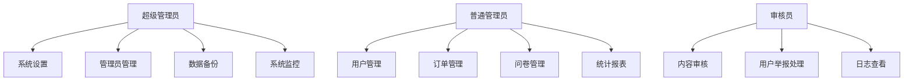

#### 4.6.2 后台统计功能

```java
@RestController
@RequestMapping("/api/admin")
public class AdminStatisticsController {
    
    @GetMapping("/statistics")
    public ResponseEntity<SystemStatistics> getSystemStatistics() {
        SystemStatistics stats = new SystemStatistics();
        
        // 用户统计
        stats.setTotalUsers(userService.getTotalUserCount());
        stats.setActiveUsers(userService.getActiveUserCount());
        stats.setPairedUsers(userService.getPairedUserCount());
        
        // 订单统计
        stats.setTotalOrders(orderService.getTotalOrderCount());
        stats.setCompletedOrders(orderService.getCompletedOrderCount());
        stats.setOrderCompletionRate(orderService.getCompletionRate());
        
        // 问卷统计
        stats.setTotalSurveys(surveyService.getTotalSurveyCount());
        stats.setActiveSurveys(surveyService.getActiveSurveyCount());
        stats.setSurveyResponseRate(surveyService.getResponseRate());
        
        // 文件统计
        stats.setTotalFiles(fileStorageService.getTotalFileCount());
        stats.setTotalFileSize(fileStorageService.getTotalFileSize());
        stats.setImageCount(fileStorageService.getImageCount());
        
        return ResponseEntity.ok(stats);
    }
    
    @GetMapping("/statistics/trends")
    public ResponseEntity<TrendData> getTrends(@RequestParam String period) {
        TrendData trends = statisticsService.getTrendData(period);
        return ResponseEntity.ok(trends);
    }
}
```

## 5. 数据流架构

### 5.1 前后端数据交互

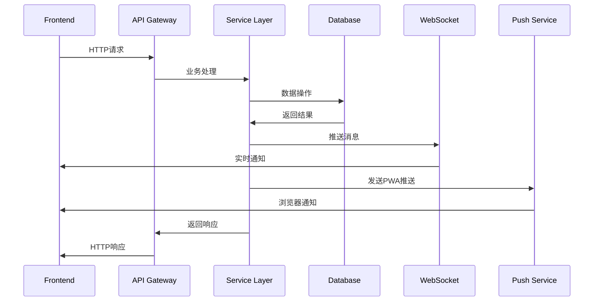

### 5.2 微信登录与文件上传流程

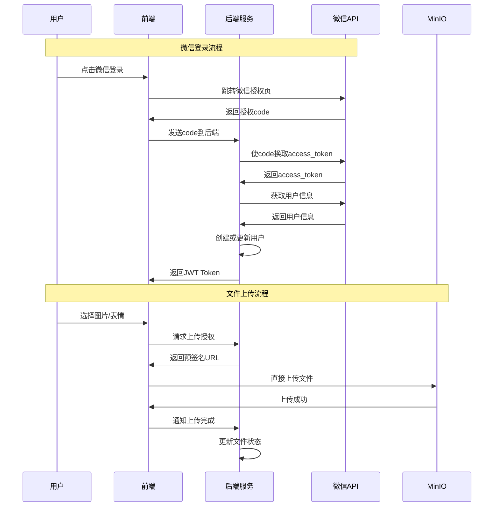

### 5.3 问卷类型处理流程

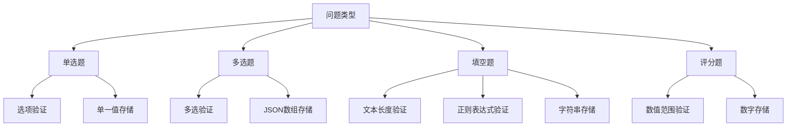

### 5.4 评价媒体处理流程

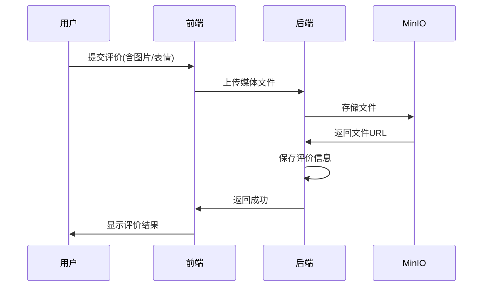

### 5.5 状态同步机制

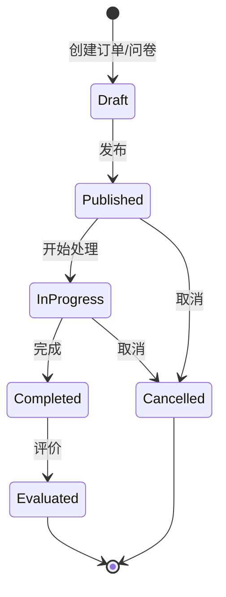

## 6. 安全策略

### 6.1 认证与授权

- **JWT Token认证**：用户登录后获取访问令牌
- **角色权限控制**：基于用户关系的权限验证
- **接口访问控制**：只能访问自己和配对伴侣的数据
- **管理员分级授权**：不同级别管理员的权限区分

### 6.2 数据安全

- **密码加密**：使用BCrypt进行密码哈希
- **敏感信息保护**：个人信息脱敏处理
- **SQL注入防护**：使用参数化查询
- **XSS防护**：前端输入验证和输出转义
- **CSRF防护**：使用CSRF Token验证

### 6.3 接口安全

- **请求频率限制**：防止恶意请求
- **HTTPS传输**：数据传输加密
- **CORS配置**：跨域请求控制
- **参数验证**：严格的输入验证
- **API版本控制**：支持向后兼容

### 6.4 文件存储安全

- **文件类型限制**：严格限制允许上传的文件类型
- **文件大小限制**：设置合理的文件大小上限
- **恶意文件检测**：扫描上传文件的恶意代码
- **内容安全检测**：图片内容审核和过滤
- **访问权限控制**：基于用户权限的文件访问控制
- **MinIO安全配置**：合理的存储桶权限和网络策略

### 6.5 微信集成安全

- **AppID/AppSecret保护**：安全存储微信应用凭证
- **授权回调验证**：验证微信授权回调的合法性
- **用户信息隐私**：合理使用微信用户信息
- **令牌安全**：安全存储和使用微信访问令牌

### 6.6 推送通知安全
- **订阅信息加密**：推送订阅数据加密存储
- **通知内容过滤**：防止敏感信息泄露
- **用户权限验证**：确保只推送给有权限的用户

## 7. 测试策略

### 7.1 前端测试

- **单元测试**：使用Jest + Vue Test Utils
- **组件测试**：关键组件的功能测试
- **E2E测试**：使用Cypress进行端到端测试
- **视觉回归测试**：UI组件的视觉一致性
- **移动端测试**：不同屏幕尺寸的适配测试
- **PWA功能测试**：推送通知、离线支持等测试

### 7.2 后端测试

- **单元测试**：使用JUnit 5 + Mockito
- **集成测试**：Spring Boot Test进行API测试
- **数据库测试**：使用TestContainers进行数据库集成测试
- **性能测试**：接口响应时间和并发测试
- **管理后台测试**：管理员功能的专项测试
- **推送功能测试**：模拟PWA推送服务测试

### 7.3 测试覆盖率目标

| 测试类型 | 覆盖率目标 | 工具 |
|----------|------------|------|
| 后端单元测试 | >80% | JaCoCo |
| 前端单元测试 | >70% | Jest Coverage |
| API集成测试 | >90% | Spring Boot Test |
| E2E测试 | 核心功能100% | Cypress |